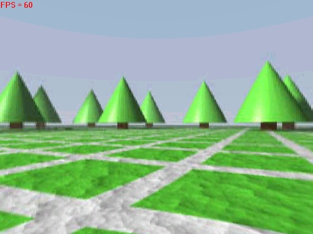



## A DIRECT3D PANORAMIC SCENE\!

### Description

CHECK THIS OUT! This is a really cool effect. Stand in the middle of a 3D world and use the mouse to rotate the camera around. All running at over 60 frames per second!!! The pictures look beautiful (thanks to Craig Nisbet - it's his artwork, but my programming). How is such a high res 3D image made to run at 60 FPS in VB? Well, I cheated ofcourse! I just used a cylinder and wrapped and image round it, then put the camera in the centre of this cylinder. But the effect looks just the same as if I were using the best quality 3D graphics using thousands of polys! You really can't see the difference. Plus, like my last submission it has the advantage of compression - why use a huge 3D file when you can just use a jpeg? This demo also features both hardware and software rendering, (BTW software = very slow) and adjustable rendering quality. There will be many more features added but I won't be able to release the source code of the final version, sorry. I hope that you agree that this deserves a decent vote, if not then please tell me why not so I can improve the program. Enjoy!
 
### More Info
 

             |
---                |---
**Submitted On**   |2000-10-24 22:16:22
**By**             |[Simon Price](https://github.com/Planet-Source-Code/PSCIndex/blob/master/ByAuthor/simon-price.md)
**Level**          |Intermediate
**User Rating**    |4.7 (61 globes from 13 users)
**Compatibility**  |VB 6\.0
**Category**       |[DirectX](https://github.com/Planet-Source-Code/PSCIndex/blob/master/ByCategory/directx__1-44.md)
**World**          |[Visual Basic](https://github.com/Planet-Source-Code/PSCIndex/blob/master/ByWorld/visual-basic.md)
**Archive File**   |[CODE\_UPLOAD1093810242000\.zip](https://github.com/Planet-Source-Code/simon-price-a-direct3d-panoramic-scene__1-12273/archive/master.zip)

